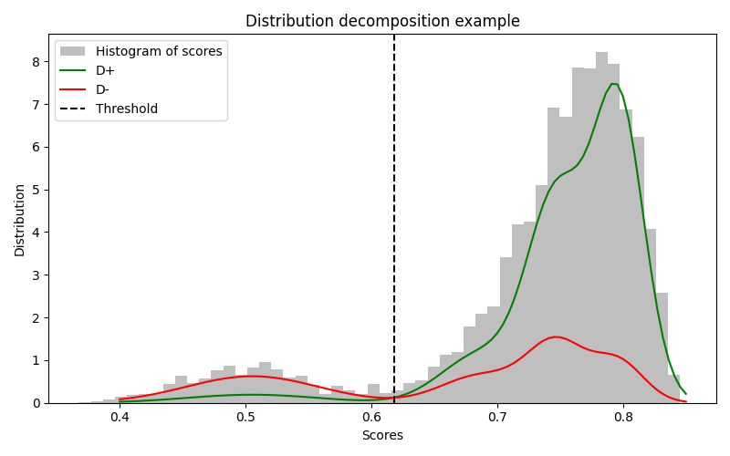
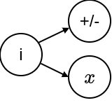

# Auto Threshold For Data Filtering

This repository is the public version of the code used in Maxime Bouthors's PhD thesis [*Towards Example-Based Neural Machine Translation*](https://theses.hal.science/tel-05129204).
The document is in French, so, for the sake of better accessibility, here is the English explanation along with the code to compute the threhsold.

## Code Execution

Given a saved numpy array of quality scores `scores.npy`, the threshold is computed by:
```bash
python auto_threshold.py \
    --input_scores scores.py \
    --t T \
    --n N \
    --a A \
    --b B
```

This script prints out a threshold value for the scores.

**Parameters**:
- **T**: probability threshold (between 0 and 1). It should be chosen between $0.5$ and $0.7$. The final threshold is computed so that the filtering is equivalent to verify $p(+|x)/(p(+|x) + p(-|x)) > T$, for a given sample score $x$.
- **N**: number of samples used to estimate the threshold.
- **A**: maximum score for which we are sure that the quality is unsufficient.
- **B**: minimum score for which we are sure that the quality is high.

Note that **A** and **B** are parameters that are model-dependant, not data-dependant. The default parameters are adapted to [wmt22-cometkiwi-da](https://huggingface.co/Unbabel/wmt22-cometkiwi-da).

[In this section](#choose-the-right-hyper-parameters), you have further details about the parameters.

The execution necessitate the installation of `numpy`, `scipy` and `scikit-learn`. This can be done with command:
```bash
pip install -r requirements.txt
```

## Problem formulation

Given a quality assessment model and a list of scores $(x_1, \dots, x_n)$ computed with this model, the objective is to automatically compute an interpretable threshold to filter the samples from.

We suppose that $x \sim \mathcal D$, and that $\mathcal D$ can be decomposed into $\mathcal D^+$ and $\mathcal D^-$, respectively a distribution of low and high quality samples, as illustrated in the following image:



The goal is precisely to identify these two sub-distributions.

## Some maths

A first hypothesis is to decompose $\mathcal D$ into a gaussian mixture of $\mathcal D_i$:

$p(x) = \sum_i w_i p_i(x) = \sum_i w_i \frac{1}{\sigma \sqrt 2} \exp(-\frac{1}{2}(\frac{x-\mu_i}{\sigma_i})^2).$

We note:
* $p(+)$ the probability of observing a sample that originates from $\mathcal D^+$
* $p(-)=1-p(+)$ the probability of observing a sample that originates from $\mathcal D^-$
* $w_i = p(i)$ the probability of observing $\mathcal D_i$
* $q_i = p(+|i)$

The probabilisitc graph associated with this problem is the following:



The choice of $q_i$ is arbitrary. We chose $q_i$ as a function of $\mu_i$ the mode of $\mathcal D_i$:
$q_i = CLAMP(\frac{\mu_i-a}{b-a}, 0, 1)$.

> This way, if $\mu_i \leq a$, then $\mathcal D_i$ fully corresponds to a low quality sub-distribution: $q_i = P(+|i) = 0$. Similarly, when $\mu_i \geq b$, then $\mathcal D_i$ fully corresponds to a high quality sub-distribution: $q_i = 1$.
> In between, $\mathcal D_i$ corresponds to a high quality sub-distribution with probability $0 < q_i < 1$.

$x$ and $+$ are independant w.r.t. $i$, which implies that:

* $p(x,+) = \sum_i p(i) p(+|i) p(x|i,+) = \sum_i w_i q_i p_i(x)$.

* $p(x,-) = \sum_i w_i (1 - q_i) p_i(x).$

Following Bayes' theorem:
$p(+|x) = \frac{p(x, +)}{p(x, +) + p(x|-)},$

which can be computed provided we know $w_i$, $q_i$ and $p_i(x)$.

Then the probability threshold $T$ can be chosen to select only samples with score $x$ s.t. $p(+|x) > T$.

> In the earlier graph, the red curve corresponds to $p(x,-)$ and the green one to $p(x,+)$. Chosing a threshold $T=0.5$ is equivalent to select a threshold $x_T$ on the score $x$ where $x_T$ is the score for which $p(x,+) = p(x,-)$.

## Estimating $w_i$, $q_i$ and $p_i(x)$

We decompose $p(x)$ into $\sum_i w_i p_i(x)$ with scikit-learn by fitting a gaussian mixture, where $p_i \sim \mathcal N(\mu_i, \sigma_i^2)$. We can deduce, $q_i = CLAMP(\frac{\mu_i-a}{b-a}, 0, 1)$. We choose $4$ gaussian components in scikit-learn, which should be enough to model the various sub-distributions.

# Choose the right hyper-parameters

* **A** and **B** are model dependant parameters, that should be chosen according to some  knowledge about the spread of scores. Back to the graph, we can observe that the scores mainly fit between **A**=0.4 and **B**=0.85, which makes them suitable choices. Note that this choice can be made only when there exists a distribution of low quality scores.
* **T** should be chosen between:
  * $0.5$: in case you wish a rather soft filtering, that may still contain some low quality samples;
  * $0.7$: in case you wish a harsh filtering to keep only high quality samples.
* **N** is linked to the precision of the threshold computation. Higher values correspond to higher precision.


